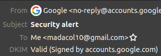
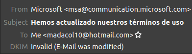

# How to verify email DKIM signatures

Keep in mind that some providers change the original source and the email you receive becomes impossible to verify without guessing how to undo the changes they made.\
Hotmail, outlook, among others, are known to do this, [source](https://github.com/lieser/dkim_verifier/wiki/FAQ#all-or-almost-all-e-mails-with-dkim-signature-are-failing-with-the-same-error)

## The simple method (you need credentials to access the account)

- Donwload and install **thunderbird**
- Connect you email account with it
- Install the Add-on [Dkim verifier](https://addons.thunderbird.net/en-US/thunderbird/addon/dkim-verifier/)
- Done!, you'll see the validation on each email

    **Valid example**\
    \
    Look the last line ↑

    **Invalid example**\
    \
    This happens on almost all emails I receive in hotmail =(

## The manual method (you only need the email's source)

- Download email, usually an `.eml` file
- Make sure you have `python` installed
- `pip install dkimpy`
- `dkimverify < email_file.eml`\
  Alternatively you can
  - `dkimverify`
  - paste email's source
  - <kbd>Ctrl</kbd>+<kbd>D</kbd>

If it succeds, it returns `signature ok`\
otherwise `signature verification failed`

## Massively verify an mbox archive

<https://github.com/associatedpress/verify-dkim>

## Caveat

If the sender's provider's DKIM-private-key is leaked or made public, then anyone in possesion of it could make a valid signature of any email, so the verification result becomes meaningless.

A way to avoid this and preserve its provability, is to timestamp the `.eml` file with a service like <https://opentimestamps.org/>.\
But it **MUST** be stamped before the private-key went public, so you can prove the email's signature existed before it became forgeable
