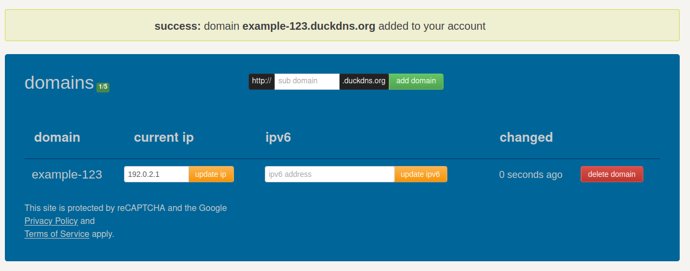

We are going to use caddy because it manages SSL certificates automatically 😍, seriously! it's magic!

## Basic

1. Point a (sub)domain to your server's public IP

    For simplicity, let's use a free DDNS like [duckdns.org](https://www.duckdns.org/) to point a subdomain (e.g. [example-123.duckdns.org](example-123.duckdns.org)) to your server's IP (e.g. [192.0.2.1](192.0.2.1))

    

2. [Install caddy](https://caddyserver.com/docs/install) in your server

3. Run it

    Assuming application is running on port 3000

    ```bash
    sudo caddy reverse-proxy \
        --from example-123.duckdns.org.com \
        --to 127.0.0.1:3000
    ```

    That's it!

## Advanced

1. Configure a domain (Namecheap's interface)

    

    More info about how to [Point a domain to an IP in a DNS provider](Point%20a%20domain%20to%20an%20IP%20in%20a%20DNS%20provider.md)

2. [Install caddy](https://caddyserver.com/docs/install)

3. Run caddy as a service

    Assuming application is running on port 3000

    The Caddyfile (In Debian / Ubuntu it's located at `/etc/caddy/Caddyfile`)

    ```Caddyfile
    www.example.com {
        redir https://example.com{uri}
    }

    example.com {
        reverse_proxy 127.0.0.1:3000
    }
    ```

    ```bash
    sudo systemctl restart caddy
    ```
