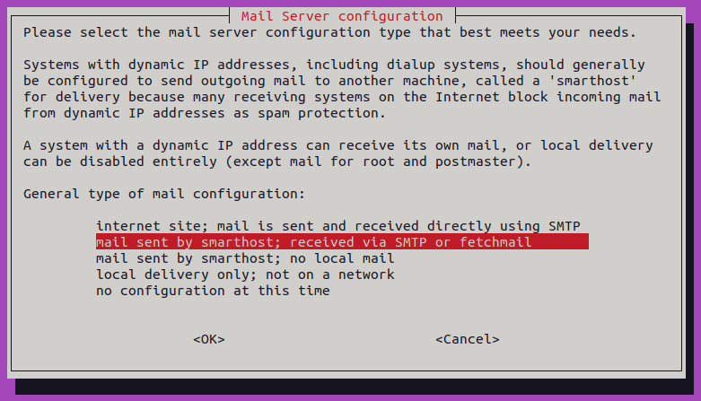
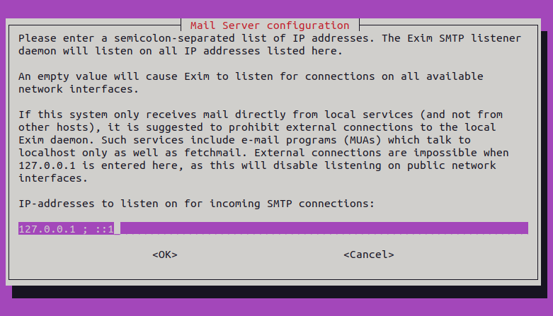
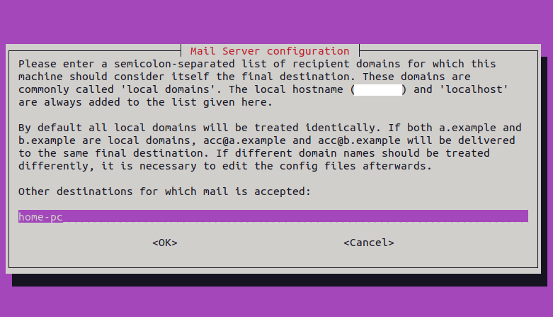
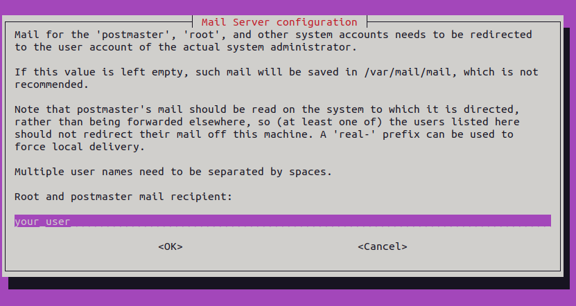

# Configure your local mail to be sent to your Gmail

## Install exim4

    sudo apt install exim4

## Configure exim4

    sudo dpkg-reconfigure exim4-config

1. **General type of mail configuration**

        mail sent by smarthost; received via SMTP or fetchmail

    

2. **System mail name**

    Leave default

    

    This is the name that will appear in the `To:` field of the email you receive. E.g. `root@home-pc`

3. **IP-addresses to listen on for incoming SMTP connections**

    Leave default

        127.0.0.1 ; ::1

    

4. **Other destinations for which mail is accepted**

    Leave default (Same as "System mail name")

        home-pc

    

5. **Machines to relay mail for**

    Leave empty.

6. **IP address or host name of the outgoing smarthost**

        smtp.gmail.com::587

    

7. **Hide local mail name in outgoing mail?**

    Leave default

        No

8. **Keep number of DNS-queries minimal (Dial-on-Demand)?**

    Leave default

        No

9. **Delivery method for local mail**

    Leave default

        mbox format in /var/mail/

10. **Split configuration into small files?**

    Leave default

        No

11. **Root and postmaster mail recipient**

    Put your OS' user here

        your_user

    

    This will add the alias `root: your_user` to `/etc/aliases`

    ***Note:** this config only appears if you don't yet have an alias for root in `/etc/aliases`.*\
    *If you set this config, it will not appear again when re-running `sudo dpkg-reconfigure exim4-config`*

## Configure your Gmail credentials

1. **Enable 2-step verification to your Google account**

    <https://myaccount.google.com/signinoptions/two-step-verification>

2. **Create an app password**

    <https://myaccount.google.com/apppasswords>

3. **Configure exim4 to use your Google credentials**

        sudo nano /etc/exim4/passwd.client

    Add the following line

        smtp.gmail.com:{your_email_user}@gmail.com:{app_password}

## Redirect root mail to your user

    sudo nano /etc/aliases

Add the following line

    {your_os_user}: {your_email}

## Restart exim4

    sudo systemctl restart exim4

## Test

    echo "This is the body of the email" | mail -s "This is the subject line" root

## Debug, see logs

    tail -f /var/log/exim4/mainlog

Other related commands

    sudo service exim4 restart
    sudo update-exim4.conf
    sudo exim4 -qff

## Sources

- <https://wiki.debian.org/Exim4Gmail>
- <https://linuxcommando.blogspot.com/2014/04/how-to-setup-exim4-on-debian-to-use.html>
- <https://stackoverflow.com/questions/72626410/how-do-i-send-email-from-nodemailer-in-nodejs-using-gmail>
- <https://unix.stackexchange.com/questions/65013/understanding-etc-aliases-and-what-it-does>
