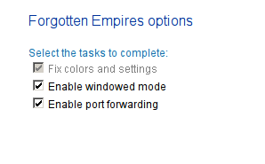
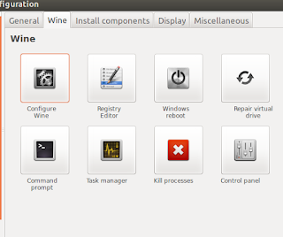
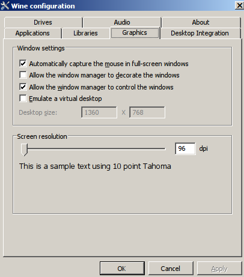
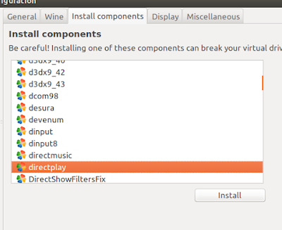
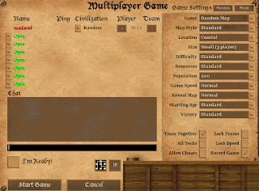

# Configuring Age Of Empires 2: Forgotten Empires on Ubuntu

We're going to need the official Installers for Age of Empires: Age of Kings and The Conquerors.

1. Install PlayOnLinux (POL)
2. Run POL's Age of Kings script (Here you'll need Age of Kings Installer)
3. Run POL's The Conquerors script (Here you'll need The Conquerors Installer)
4. Run POL's Forgotten Empires script (This will download and install automatically this installer: [https://forgottenempires.net/AoFE_Launcher.exe](https://www.forgottenempires.net/install))
5. If sound does not work, change wine version to a newer one

It works!, but it has some annoying bugs with resolution and fullscreen, so the solution I got was to make it windowed, almost borderless and filled the screen with it. So let's do it.

1. Run `FixAoFE.exe` in the Forgotten virtual drive
   1. Open POL and select Forgotten
   2. Click Configure
   3. Tab Miscellaneous
   4. Click "Run a .exe ..."
   5. Locate FixAoFE.exe in `~/PlayOnLinux's virtual drives/AOE2_forg/drive_c/Program Files/Microsoft Games/Age of Empires II/age2_x1/FixAoFE.exe`
2. Enable Windowed mode
   
   

3. Open Configure Wine
   
   

4. Open **Graphics** tab, and make exactly these selections:

   

5. Open the game and choose your desired resolution in options. This resolution will only affect in-game, it won't affect the menu.

It still has some bugs, but it's now playable, the inner game is mostly free of bugs, and with the new 60 FPS feature of the Forgotten Empires, is a net improvement.

There are two bugs that still bother me:

1. For some really strange reason, enemies' Castles do not start firing until you get really close to them, or maybe attack them. I've seen this happen in the first chapter of barbarossa campaign.
2. Multiplayer does not work. Right now, if you try to create a multiplayer game it will go back to the menu immediately. We can overcome this bug by installing directplay:

   
   
   It now Creates a multiplayer game

   
   
   But still, I haven't been able to join a multiplayer game between two computers using the same setup, I've tried with LAN, with IP, disabling firewalls, but no luck :(