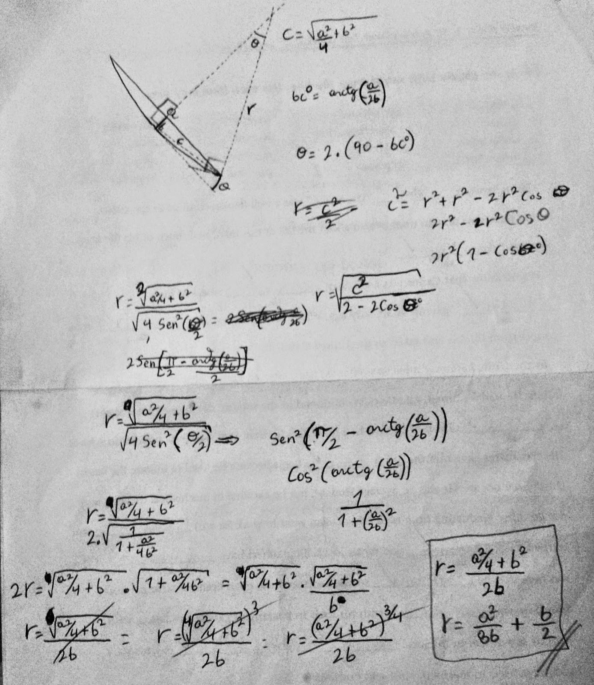

# Formula para calcular el Radio de curvatura

Primero vayamos al grano.

`a` es la distancia entre cada [intersección](https://es.wikipedia.org/wiki/Interseccion) que hay entre la circunferencia y la [secante](https://es.wikipedia.org/wiki/Secante).

Y `b` es la distancia perpendicular de la secante hasta una [tangente](https://es.wikipedia.org/wiki/Tangente) paralela a ella. *(hay varias formas de definir a `b`)*

Hace mucho tiempo me tocó deducir esta formula porque nunca la logré conseguir por internet *(aunque a la final nunca hizo falta jeje)*.

Lo que me motivó a deducirla era que hacia falta fabricar unos álabes de un impulsor que tenian una ligera curvatura cóncava, y debido a la falta de planos, tocaba copiar la muestra y necesitaba calcular ese radio de curvatura, y asi es que se me ocurrió esta idea de medir la longitud de una regla o un palo recto **(a)**, ponerlo paralelo a la direccion de la curvatura, para luego medir desde el centro del palo perpendicularmente hasta el fondo de la pieza **(b)**, y así con solo esos dos datos poder calcular el radio de curvatura.

Este es el borrador en donde hice las deducciones, pero les advierto que está muy desorganizado y con tachaduras.

