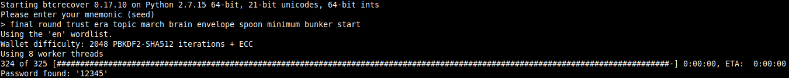

# Recover a BIP39 password with a P2SH(P2WPKH) address by Brute-forcing

***There's an up-to-date fork of this tool here <https://github.com/3rdIteration/btcrecover> ***\
***Use it skeptically, just as you should with this post***

---

This will allow you to brute-force wallets supported by [**btcrecover**](https://github.com/gurnec/btcrecover) but that have P2SH(P2WPKH) addresses (i.e 3G2rhsBYmP6RKrjW1kVE1kJB9qjwggaCZw) BIP141 (addresses not yet supported by btcrecover as of writing).

If my changes have been merged [here](https://github.com/gurnec/btcrecover/pull/302), then get out of here, download [**btcrecover**](https://github.com/gurnec/btcrecover) and follow it's instruction.

If not, then download my version of the tool <https://github.com/madacol/btcrecover/tree/p2wpkh-p2sh> and follow original instructions [**btcrecover**](https://github.com/gurnec/btcrecover)

### You can get the modified version in 2 ways

- download the zip file from <https://github.com/madacol/btcrecover/tree/p2wpkh-p2sh>
- clone my repo, and checkout the branch **`p2wpkh-p2sh`**
  ```
  git clone https://github.com/madacol/btcrecover/
  cd btcrecover
  git checkout p2wpkh-p2sh
  ```

I used this to recover a Samourai wallet that had a BIP39 seed, where the seed is generated using a mnemonic (12–24 words) and a passphrase. To bruteforce it you need to have and address or the master public key, and I only had addresses that started with a 3… ( P2SH(P2WPKH) addresses ), and they use BIP49 to derive the keys

You can test this by making a `password.txt` inside btcrecover's folder containing:

```
1
2
3
4
5
```

and running this command:

```bash
python2 btcrecover.py --bip39 --tokenlist passwords.txt --addrs 3G2rhsBYmP6RKrjW1kVE1kJB9qjwggaCZw --mnemonic-prompt --addr-limit 1 --bip32-path "m/49'/0'/0'/0"
```

You will be asked for the mnemonic:

    final round trust era topic march brain envelope spoon minimum bunker start

This should give you the following result:



You can customize LOTS of things, go and read the full instructions <https://github.com/gurnec/btcrecover/blob/master/TUTORIAL.md#btcrecover-tutorial>
